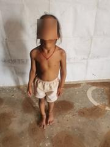
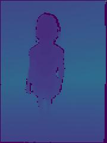
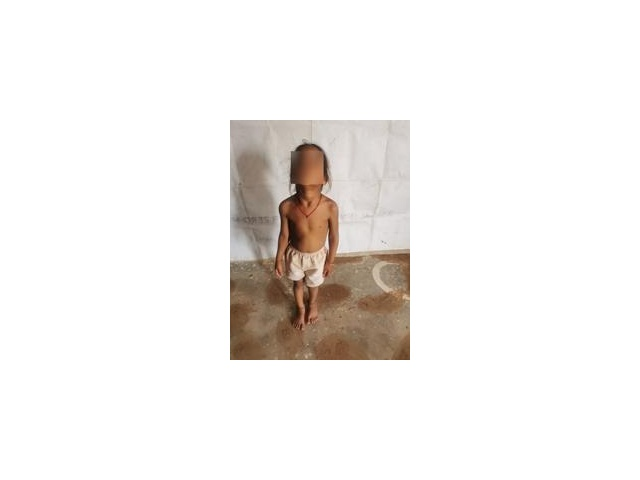
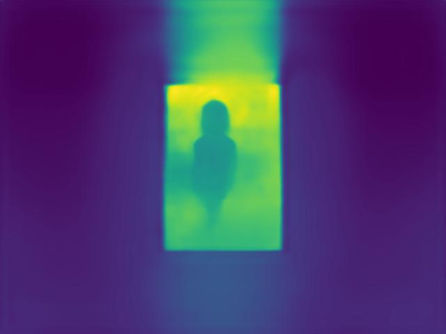
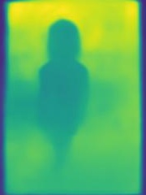
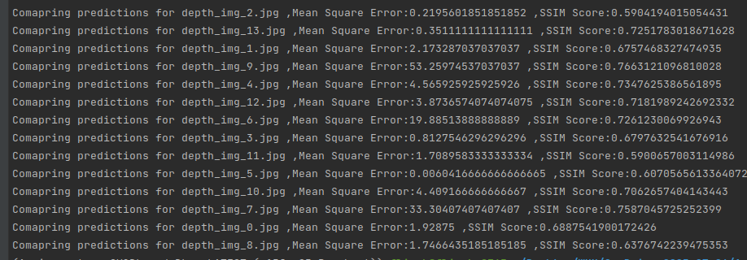

# **RGB to Depth Map and comparison**

**Problem Statement:**

1. Convert RGB to depth map
2. Compare depth map with existing TOF sensors depth maps.

**Research:**

There are various propositions available to estimate depth from RGB images, such as Adabins, DenseDepth, Monodepth, Monodepth2.
I have picked [Adabins](https://arxiv.org/abs/2011.14141) to generate depth maps.

**Solution:**

**Step 1:**

    First I Extracted 1 image per scanned files provided and saved RGB and Depth map separately.
    The following is done via read_data.py script. One sample of the extracted data is as below -

 

Step 2:

	Next I added white padding around the RGB images, this is required to create (640x480) images
    which is the required input size for adabins to work. The method was performed to keep the main image size and information intact.
    We need to run **_pad.py _**to complete this step. One output is showcased as below-

Step 3:

	Run adabins in colab, upload the images post setup and save outputs to local.
    The script I have added as git so that the results can be saved too.
    Find it AdaBinDemo.ipynb

Points to note, I have used nyu version of the models available for better results. An output is as below - 

Step 4:

	We crop the ROI by using remove_pad.py. We need this step to compare the images with TOF sensor outputs.
    Post cropping generates output is as below - 

Step 5: 

    Now we need to run similarity_check.py to get the comparison of original and predicted depth maps.

Results:

I have chosen Mean Square Error  and Structural Similarity Index(SSIM) to evaluate the predictions. I have selected 14 different images, each from one of the scan files, results are as below - 

MSE is lower for similar images, and SSIM returns a value between 0-1, where close to 1 represents similarity and close to 0 is opposite.

**Requirements:**

Python3, scikit-image, numpy, opencv

**Guide to the repo:**

The “Resources” directory contents all the output from my codes. Inside this few directories are there as below - 

* Depth_adabins : Predicted depth images from adabins.
* Depth_original : contains original depth files extracted.
* Predicted_adabins : padding removed adabins predictions.
* Resized: padded rgb images
* RGB : Original RGB Images

The “Data” directory contains the data provided for the assignment.

“read_data.py” - reads the data from scanned files and saves locally.

“pad.py” - add padding to the extracted images to input in Adabins.

“remove_pad.py” - remove padding post detection from adabins.

“check_similarity.py” - outputs in comparison of the images (original and predictions), shows the differential image one by one and prints mse and ssim values.

Thank You
